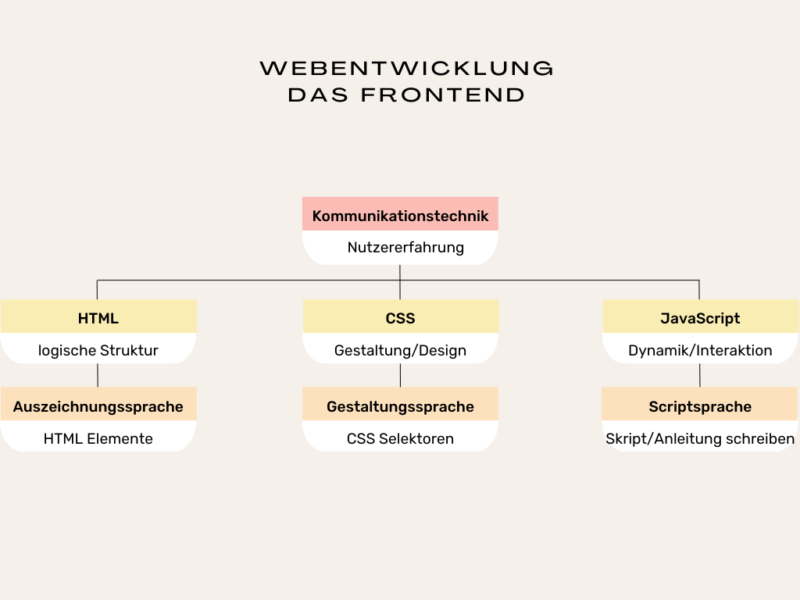
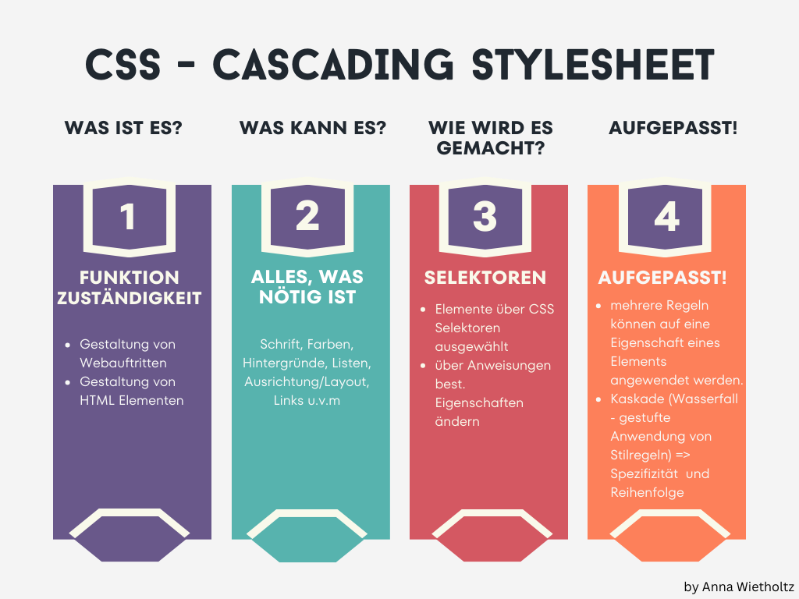

# HTML und CSS Spickzettel 💻🤓💡

## Allgemein

[HTML](#1-html-die-websprache-für-das-gerüst-einer-website) und [CSS](#2-css-die-websprache-für-die-gestaltung-einer-website) sind Websprachen. Sie werden von Webentwickler*innen genutzt, um über den Webbrowser Webauftritte überhaupt erstmal anzeigen zu lassen.  Sobald wir HTML und CSS verwenden, kommunizieren wir mit dem Webbrowser. Wir kommunizieren über Code mit dem Webbrowser, der wiederum den Code den Nutzern unserer Website "übersetzt". Nutzer können sich über eine statische Website über bestimmte Themen informieren. Sobald Nutzer mit der Website (auch oft dann WebApp) interagieren, kommt die Skriptsprache [JavaScript](#3-js-die-websprache-für-die-dynamik-einer-website) hinzu. Alle drei Websprachen zusammen werden im **Frontend** – der Aufgabenbereich, der sich auf die Benutzeroberfläche konzentriert – genutzt. 

<br>

 *Abb.: Websprachen und ihre Aufgaben*


<br><br>

## Inhalt

1. [HTML-Elemente](#html-elemente)
  - [Grundstruktur](#grundstruktur-einer-html-seite)
    - [Head-Elemente](#head-elemente-erscheinen-nicht-auf-der-seite-sondern-nur-infos-für-den-browser-und-google)
    - [Body-Elemente](#body-elemente-der-sichtbare-bereich-eurer-webseite)
        - [Block Elemente](#block-elemente-nehmen-die-gesamte-breite-des-elternelements-ein)
        - [Inline Elemente](#inline-elemente-nehmen-nur-die-breite-ihres-inhalts)

2. [CSS - die Gestaltung einer Website](#2-css-die-websprache-für-die-gestaltung-einer-websiteCSS-die-websprache-für-die-gestaltung-einer-website) 
- [CSS-Eigenschaften](#css-eigenschaften)
    - [Textformatierung](#textformatierung)
    - [Größen](#größen-abstände-und-rahmen-boxmodel)
    - [Hintergrund](#hintergrund)
    - [Flexbox](#flex-erste-schritte)
- [CSS-Selektoren](#selektoren) 
    - [reine CSS-Selektoren](#selektoren)
    - [Selektoren mit HTML Attributen](#selektoren-mit-html)
- [Hyperlinks gestalten](#hyperlinks-gestalten)
  
<!-- 3. [JavaScript](#3-js-die-websprache-für-die-dynamik-einer-website) -->

4. [nützliche Tastenkombinationen](#4-nützliche-tastenkombinationen)


<br><br><br>

<!-- 

## 1. HTML die Websprache für die logische Struktur des Inhalts einer Website

## HTML-Elemente
**HTML** steht für ***Hypertext Markup Language*** und ist eine Auszeichnungssprache, die verwendet wird, um den Inhalt einer Webseite zu strukturieren und zu kennzeichnen. HTML ist zuständig für die Markierung verschiedener Elemente wie Überschriften, Fließtexte, Bilder und Links, damit der Webbrowser die Elemente den Nutzern anzeigen und für weitere Zwecke nutzen kann. In der Regel sind HTML Elemente valide – also gültig – wenn sie ein sogenanntes **Start - und Endtag** aufweisen.

```
<p>Ich bin ein Text, der für den Webbrowser als Textabsatz (abgekürzt p) markiert wurde.</p>
```
``` 
<!-- Ich bin ein HTML Kommentar -->

<!--
 ```
---

> [!TIP]
> Start- und Endtag bestimmen den Anfang und das Ende der Markierung.

---
---

> [!TIP]
> nur wenn Texte, Bilder etc. richtig markiert wurden, können sie später gefärbt, ausgerichtet, allgmein gestaltet werden ohne dabei Verfahrensfehler zu riskieren! 

---

> [!TIP]  
> Kommentare sind für Menschen wichtig, damit Code in der Entwicklungsumgebung nachvollbar wird. Sie sind nützlich, um Hinweise zum Code zu geben. Kommentare werden im Browser nicht für Nutzer *innen angezeigt. 

<br><br><br>


### Grundstruktur einer HTML-Seite

| HTML-Element    | Beschreibung                                    | Beispiel                              |
|:---------------:|:-----------------------------------------------:|:-------------------------------------:|
| `<!DOCTYPE html>`| Definiert den Dokumenttyp und die HTML-Version  | `<!DOCTYPE html>`                     |
| `<html>`        | Wurzelelement einer HTML-Seite                  | `<html>...</html>`                    |
| `<head>`        | Enthält Metadaten und Links zu Stylesheets etc. | `<head>...</head>`                    |
| `<body>`        | Enthält den für Nutzer sichtbaren Inhalt der Webseite      | `<body>...</body>`                    |
<br>

**Beispiel**

```
<!DOCTYPE html>
<html>
    <head>...</head>
    <body>...</body>
</html>
```
<br>

> [!TIP]
> `<head>`und `<body>` befinden sich innerhalb des `<html>` Wurzel Elements - diese Elemente sind also in Wurzelelement verschachtelt oder anders gesagt, liegen zwischen **Start- und Endtag** des `<html>`Elements.

<br><br><br>

### Head-Elemente (erscheinen nicht auf der Website, sondern sind Infos für den Browser und bspw. auch Google)

| HTML-Element | Beschreibung                                           | Beispiel                                 |
|:------------:|:------------------------------------------------------:|:----------------------------------------:|
| `<title>`    | Titel der Webseite, erscheint in der Browser-Tab-Leiste | `<title>Meine Webseite</title>`          |
| `<meta>`     | Metainformationen, z.B. Zeichensatz oder Keywords       | `<meta charset="UTF-8">`                 |
| `<link>`     | Verknüpfung mit externen Dateien, z.B. CSS-Stylesheets  | `<link rel="stylesheet" href="style.css">`|

<br><br><br>


### Body-Elemente (der sichtbare Bereich einer Webseite)
    
| HTML-Element  | Beschreibung                               | Beispiel                             |
|:-------------:|:------------------------------------------:|:------------------------------------:|
| `<h1>`...`<h6>` | Überschriften                            | `<h1>Überschrift</h1>`               |
| `<p>`          | Textabsatz                                | `<p>Textabsatz</p>`                  |
| `<a>`        | Hyperlink (intern, extern)      | `<a href="./unterseite.html"> Dies ist der klickbare Linktext </a>`<br>`<a href="url"> Die ist der klickbare Linktext</a>`|
| ``      | Bild einfügen                                 | ``  |
| `<ul>`         | Ungeordnete Liste                         | `<ul><li>Element</li></ul>`          |
| `<ol>`         | Geordnete Liste                           | `<ol><li>Erstes Element</li></ol>`   |
| `<li>`         | Listenelement                             | `<li>Listeneintrag</li>`             |

#### HTML Attribute

Einige HTML Elemente brauchen notwendigerweise Zusatzinformationen, um zu funktionieren. Diese Zusatzinformationen müssen mit einem sogenannten Schlüssel-Wert Paar im Starttag des jeweiligen HTML Elements angegeben werden. 

| HTML-Attribut  | Beschreibung                               | Beispiel                             |
|:-------------:|:------------------------------------------:|:------------------------------------:|
| `href` | Schlüssel des Attributs                            | `<a href="./kontakt.html">Zur Kontaktseite</a>`|
| `"./kontakt.html"` | Wert des Attributs(hier Strukturpfad/Wegbeschreibung zum gewünschten Zieldokument)|`<a href="./kontakt.html">Zur Kontaktseite</a>`|


#### Block-Elemente (nehmen die gesamte Breite des Elternelements ein)

| HTML-Element  | Beschreibung                               | Beispiel                             |
|:-------------:|:------------------------------------------:|:------------------------------------:|
| `<h1>`...`<h6>` | Überschriften                            | `<h1>Überschrift</h1>`               |
| `<p>`          | Textabsatz                                | `<p>Textabsatz</p>`                  |
| `<ul>`         | Ungeordnete Liste                         | `<ul><li>Element</li></ul>`          |
| `<ol>`         | Geordnete Liste                           | `<ol><li>Erstes Element</li></ol>`   |
| `<li>`         | Listenelement                             | `<li>Listeneintrag</li>`             |
| `<div>`        | generisches Containerelement                          | `<div>Inhalt</div>`                  |
<br>

##### Containerelemente, die eine klare vordefinierte Bedeutung markieren (semantisch):

| HTML-Element  | Beschreibung                               | Beispiel                             |
|:-------------:|:------------------------------------------:|:------------------------------------:|
| `<header>`    | Definiert den Kopfbereich eines Dokuments oder einer Sektion. | `<header>Kopfbereich</header>`       |
| `<main>`      | Hauptinhalt des Dokuments, sollte einzigartig sein. | `<main>Hauptinhalt</main>`           |
| `<footer>`    | Definiert den Fußbereich eines Dokuments oder einer Sektion. | `<footer>Fußbereich</footer>`        |
| `<section>`   | Thematisch zusammenhängender Bereich eines Dokuments. | `<section>Abschnitt</section>`       |
| `<nav>`       | Definiert eine Gruppe von Navigationslinks. | `<nav>Navigation</nav>`              |
| `<article>`   | Unabhängiger Artikel, der in sich geschlossen ist. | `<article>Artikel</article>`         |

<br><br>

> [!TIP]
> Ein generisches HTML Element kann als Inhalt alle möglichen anderen Elemente verschachteln ohne spezifisch zu werden. Semantische HTML Elemente definieren ihren Inhalt sehr konkret, so sollte man nicht einen Fließtext mit einem `nav` Element markieren. 

> [!important]
> Je sorgfältiger man von Anfang arbeiten, desto weniger Vorgangsfehler entstehen in der weiteren Entwicklung einer Website.

<br>
   
#### Inline Elemente (nehmen nur die Breite ihres Inhalts)

| HTML-Element | Beschreibung                    | Beispiel                              |
|:------------:|:-------------------------------:|:-------------------------------------:|
| `<a>`        | Hyperlink (intern, extern)      | `<a href="./unterseite.html"> Dies ist der klickbare Linktext </a>` <br>  `<a href="url"> Die ist der klickbare Linktext. </a>`           |
| `<span>`       | Element, das ausgewählten Bereich makiert  | `<p> Dies ist ein Textabsatz und innerhalb dieses Fließtextes kann ich bestimmte <span>Bereiche</span> zusätlich makieren.</p>`         |
| ``      | Bild einfügen                                 | ``  |

  <br>

[zurück zur Inhaltsübersicht](#inhalt)

<br>

## 2. CSS die Websprache für die Gestaltung einer Website
<br>


 *Abb.: CSS im Überblick*

## CSS-Eigenschaften

**CSS** steht für ***Cascading Style Sheets*** und wird verwendet, um HTML-Elementen in ihrem Standardaussehen auf einer Webseite zu verändern. Mit CSS können verschiedene Eigenschaften wie Farbe, Schriftart und Positionierung bearbeitet werden. Konventionen, wie etwa "die Trennung von Zuständigkeiten" ermöglicht es nicht nur strukturiert und übersichtlich zu arbeiten, sondern auch externe Stylesheets wiederzuverwenden. Deswegen sollte man das externe stylesheet dem internen styleheet bevorzugen und auf inline Styling verzichten (hier geht es darüberhinaus um bestimmte Browserkonzepte wie bspw. die Spezifizität, die greifen können und die Pflege/Wartung eines Webauftritts erschweren und behindern können)


Da es sich bei CSS, um eine andere Websprache als HTML handelt, ändert sich auch die Syntax (Schreibweise) :

```
 /* auch die Kommentare sehen in CSS anders aus, werden aber noch mit strg + # ausgelöst */
/* p ist hier der Selektor (Auswahlwerkzeug) und teilt dem Browser mit,
 dass alle HTML Elemente des Typus p ausgewählt werden sollen,
 um dann die Eigenschaften dieser Elemente im Deklarationsblock (Bereich innerhalb der geschweiften Klammern) ändern zu können */

p {
    color: blue;
/* Eigenschaft: Wert; */
  }

```

[zurück zur Inhaltsübersicht](#inhalt)

<br>


### Textformatierung
| Eigenschaft       | Beschreibung                                   | Beispiel                        |
|-------------------|------------------------------------------------|---------------------------------|
| `color`           | Setzt die Textfarbe.                           | `color: blue;`                  |
| `font-size`       | Bestimmt die Schriftgröße.                     | `font-size: 16px;`              |
| `text-decoration` | Fügt Dekorationen wie Unterstreichungen hinzu. | `text-decoration: underline;`   |
| `font-weight`     | Definiert die Dicke der Schrift.               | `font-weight: bold;`            |
| `font-family`     | Bestimmt die Schriftart.                       | `font-family: Arial, sans-serif;`|
| `font-style`      | Legt den Stil der Schrift fest (z.B. kursiv).  | `font-style: italic;`           |

[zurück zur Inhaltsübersicht](#inhalt)

<br>


### Größen, Abstände und Rahmen (Boxmodel)
| Eigenschaft | Beschreibung                            | Beispiel              |
|-------------|-----------------------------------------|-----------------------|
| `width`     | Setzt die Breite eines Elements.        | `width: 100px;`       |
| `height`    | Bestimmt die Höhe eines Elements.       | `height: 200px;`      |
| `margin`    | Bestimmt den Außenabstand eines Elements. | `margin: 20px;`       |
| `padding`   | Setzt den Innenabstand eines Elements.  | `padding: 15px;`      |
| `border`    | Definiert die Rahmenlinie eines Elements. | `border: 1px solid black;` |

[zurück zur Inhaltsübersicht](#inhalt)

<br>


### Hintergrund
| Eigenschaft           | Beschreibung                                          | Beispiel                            |
|-----------------------|-------------------------------------------------------|-------------------------------------|
| `background-color`    | Legt die Hintergrundfarbe fest.                       | `background-color: yellow;`         |
| `background-image`    | verknüpft über url Funktion ein hinterlegtes Bild und legt es als Hintergrund fest.                       | `background-image: url(../bilder/hintergrund.jpg);`         |
| `background-size`     | Bestimmt die Größe des Hintergrundbildes.             | `background-size: cover;`           |
| `background-repeat`   | Legt fest, ob und wie das Hintergrundbild wiederholt wird. | `background-repeat: no-repeat;`     |
| `background-position` | Definiert die Position des Hintergrundbildes.         | `background-position: center;`      |
| `background-attachment` | Legt fest, ob das Hintergrundbild scrollt oder fixiert ist. | `background-attachment: fixed;` |


[zurück zur Inhaltsübersicht](#inhalt)

<br>


## Flex (erste Schritte)
### Flexbox gehört zu den modernen Layouttechniken, die Ausrichtung der Kindelemente flexibel steuert

| Eigenschaft      | Beschreibung                                            | Beispiel                        |
|------------------|---------------------------------------------------------|---------------------------------|
| `display`        | Legt den flexiblen Container fest und stellt so Kinder nebeneinander.    (Achtung: display wird nicht nur für flex verwendet!)                   | `display: flex;`                |
| `justify-content`| Bestimmt die Ausrichtung der flexiblen Elemente entlang der Hauptachse. (hier horizontal) | `justify-content: center;`      |
| `align-items`    | Bestimmt die Ausrichtung der flexiblen Elemente entlang der Querachse. (hier: vertikal) | `align-items: center;`          |
| `gap`            | Legt den Abstand zwischen den flexiblen Elementen fest. | `gap: 10px;`                    |

**die goldene Mitte - Kindelemente werden horizontal und vertikal zentriert kann man über lediglich drei Eigenschaft-Wert Paare erzeugen - `display: flex; justify-content: center; align-items: center;`**

<br>

> [!important]
> Diese Technik lohnt sich, wenn ein Elternelement mehr als 1 Kind besitzt, da die Ausrichtung von Kindelementen innerhalb eines Elternelements beeinflusst wird.

[zurück zur Inhaltsübersicht](#inhalt)

<br>

## Erweiterte CSS-Effekte
| Eigenschaft           | Beschreibung                                          | Beispiel                            |
|-----------------------|-------------------------------------------------------|-------------------------------------|
| `transition`          | Definiert Übergangseffekte zwischen zwei Zuständen eines Elements. | `transition: all 0.3s ease;`       |
| `box-shadow`          | Fügt einem Element einen Schatten hinzu.              | `box-shadow: 0px 4px 8px rgba(0,0,0,0.3);` |


[zurück zur Inhaltsübersicht](#inhalt)

<br>


<br>

## Selektoren
### reine CSS Selektoren

| Selektor              | Beschreibung                                          | Beispiel                            |
|-----------------------|-------------------------------------------------------|-------------------------------------|
| Typselektor       | Wählt alle Elemente eines bestimmten Typs aus.        | `p { color: blue; }`                |
| Kind-Selektor      | Wählt alle Kindelemente innerhalb eines ausgewählten Typus aus.  | `main > section { color: red; }`        |
| Nachfahren-Selektor   | Wählt alle Elemente innerhalb eines bestimmten Elternteils aus. | `div p { color: green; }`          |
| `:nth-of-type()`              | Wählt alle Elemente die in dem gewählten Typus an einer bestimmten Stelle vorkommen  -> im Beispiel werden alle p Elemente ausgewählt die an 1.Stelle in einer bestimmten Reihenfolge vorkommen  | `p:nth-of-type(1) { color: red; }`           |

<br>

### Selektoren mit HTML

Es gibt CSS Selektoren, die brauchen zusätzlich eine Veränderung in unserem HTML Dokument. Durch das setzen von Attributen, auf die diese Selektoren zugreifen, wird der Konvention **Trennung
von Zuständigkeiten** (jede Websprache hat ihren Aufgabenbereich) nicht befolgt. Man sollte grundsätzlich in Maßen mit dem Klassenselektor umgehen. Klasseneigenschaften von HTML Elementen sind wertvoll wenn sie gestalterisch gruppieren. 
**Ids als Attribute für gestalterische Zwecke zu nutzen, wird nicht empfohlen** 
 

| Selektor              | Beschreibung                                          | Beispiel                            |
|-----------------------|-------------------------------------------------------|-------------------------------------|
| Klassenselektor       | Wählt alle Elemente aus die eine Klasse als Eigenschaft erhalten haben. Der Wert der Klasse und der . ist die Referenz für die Auswahl       | `.active { background-color: orange; }`                |


<br>

[zurück zur Inhaltsübersicht](#inhalt)

<br>

### Hyperlinks gestalten
**Hyperlinks sind klickbare Elemente und können auch je nach Zustand (wurde Link geklickt?, läuft die Maus über den Link?) gestaltet werden**

> [!important]
> Falls mehr als ein Zustand gestaltet wird, ist die Hierarchie der möglichen Zustände zu beachten

| Eigenschaft           | Beschreibung                                          | Beispiel                            |
|-----------------------|-------------------------------------------------------|-------------------------------------|
| `:link`    | gestaltet den Link im unberührten/ungeklickten/unbesuchten Zustand                       | `a:link {text-decoration: none;}`         |
| `:visited`    | gestaltet den Link im schon zuvor besuchten Zustand                       | `a:visted { color: purple;}`         |
| `:active`     | gestaltet den Link im aktiven Zustand - wenn man den Link gedrückt hält             | `a:hover { box-shadow: 5px 5px 15px solid purple;}`           |
| `:hover`   | gestaltet den Link, wenn Maus drüber läuft | `a:hover {text-decoration: underline;}`     |

<br>

[zurück zur Inhaltsübersicht](#inhalt)

<br>

-->

## 4. Nützliche Tastenkombinationen

Tastenkombinationen, die in **VS Code** und anderen Programmen funktionieren:

- Fenster wechseln = `Alt` + `Tab`
- Fenster nebeneinanderstellen/Fensteransicht auf 50% runterskalieren = `Win` + `linke oder rechte Pfeiltaste`
- Kopieren         = `STRG` + `c`
- Ausschneiden     = `STRG` + `x`
- Einfügen         = `STRG` + `v`
- rückgängig       = `Strg` + `z`
- Suchen           = `STRG` + `f`
- Speichern        = `STRG` + `s`
- alles markieren  = `STRG` + `a`


<br>

### VS-Code

Diese praktischen Kombinationen funktionieren nur in VS Code unter windows:
- `STRG`+ `#`          = erzeugt einen Kommentar 
- `!`+ `tab`          = erzeugt das HTML Grundgerüst (auch boilerplate genannt) 
- `p` + `tab`          = erzeugt ein HTML Textabsatz (wenn ihr h1 wählt erzeugt es eine h1 Überschrift etc.)
- `AltGr` + `7`        = erzeugt die geschweiften Klammern , den Deklarationsblock in CSS `{ }`

**Bonus:**

- `Alt` + `Pfeiltaste` = Zeilen verschieben, hoch/runter
- `Alt` + `z`          = Zeilenumbruch anschalten/ausschalten
- `STRG`+ `l`          = Zeile markieren

<br><br>

<!-- 
#### Emmet Abkürzungen in VS Code

Emmet sind Kurzformen, die VS Code zu Code umschreibt, hier einige kurze Beispiele für ***HTML***:
- `!`               = erzeugt in einen Boilerplate-Code (Grundstruktur)
- `lorem50`         = erzeugt einen Lorem-Text mit 50 Worten
- `div.box`         = erzeugt eine `<div class="box">`
- `ul>li*3`         = erzeugt eine `<ul>` mit 3 `<li>`Elementen
- `a{mehr dazu}`  = erzeugt ein `<a href="">mehr dazu</a>`
- `section>img+p+a` = erzeugt eine Sektion und darin ein ``, `<p>`und ein `<a>`

> [!important]
> Kombiniert man Elemente miteinander kann man sehr umfangreiche Codeblöcke bauen. Je länger Kombinationen sind, desto leichter können Fehler produziert werden - nicht den Überblick verlieren!
***[Emmet Cheat Sheet](https://docs.emmet.io/cheat-sheet/)***


[zurück zur Inhaltsübersicht](#inhalt)
 <br>

-->